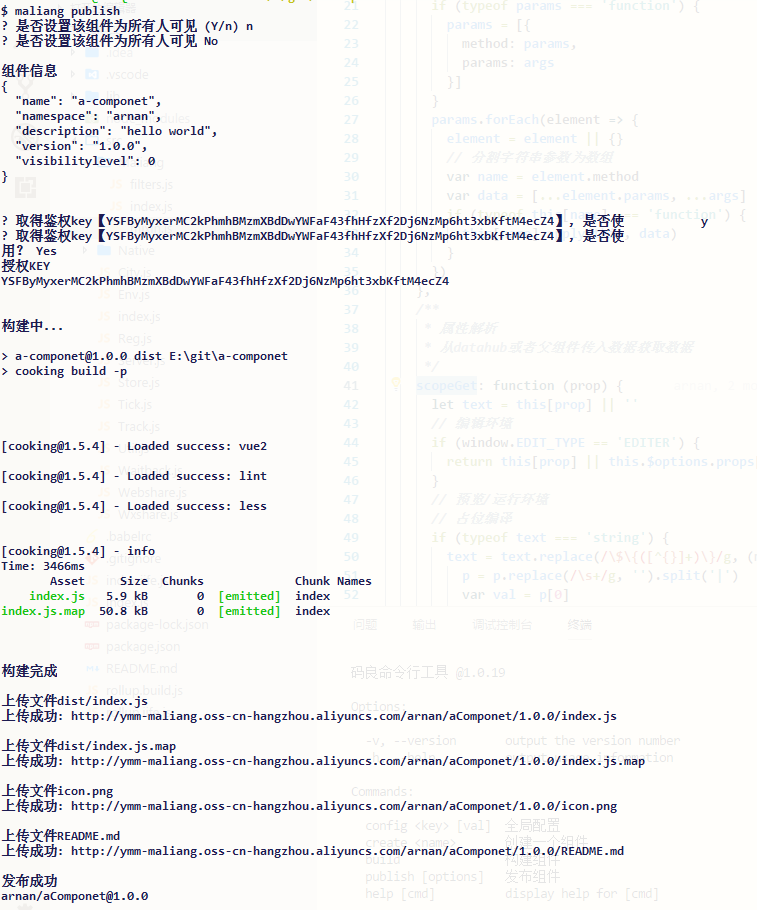

# 组件开发

官方已经提供了一些[基本组件](../cookbook/component.html#基础组件)，同时，码良也提供了第三方组件的接入能力

## `maliang`

`maliang` 是基于 `nodejs` 的命令行工具，提供了覆盖组件开发全流程的工具

```shell
npm install maliang-cli -g
```


## 设置`registry`

码良是一个开源项目，支持私有部署，因此需要设置`registry`指明向哪个组件仓库来提交组件。

```shell
# 设置为官方组件仓库 godspen.ymm56.com
maliang config registry http://godspen.ymm56.com
```
## 设置`token`

`token` 即用户凭据，可以在码良后台（左侧菜单-用户设置-access）取得，用来确认开发者身份。如未提供 `token` 则组件不能发布成功。

```shell
maliang config token DEcTjQRFbiYitFydhC2m5kd8JHieQrsztrbiPaz5DbHk68AWbmMBe7ShXw2ncwp5
```
此设置非必须，也可在发布组件时于命令行交互中填写。

## 创建组件

```shell
maliang create <your-component-name> # maliang create test-com
```


按提示输入相应信息即可。注意，“命名空间”为一个字符串， 用来区别开发者

创建组件时有一个选项“是否创建属性配置组件”，默认为否，如果选择是的话，组件工程内除包含组件本身，还包含一个属性配置组件，可以实现更加灵活的自定义属性设置。

## 开发/预览组件

```shell
# cd <component-dir>
# yarn install
yarn start
# or
npm run dev
```

进入工程根目录，

`/src/index.vue` 即为刚才创建的组件。组件开发的主要工作就是针对这个组件进行功能实现。

若之前选择了“创建属性配置组件”，`/editor/index.vue` 即为属性配置组件。属性配置组件用于在编辑器中自定义组件配置面板。

码良组件本身与普通 vue 组件无异，只是在普通 vue 组件的基础上，我们添加了一些约定字段，使组件能被码良编辑器识别、配置。这些约定字段其实已经在[脚本开发](./script.html)部分介绍过了，见[自定义属性](./script.html#添加自定义属性)、[自定义方法](./script.html#添加自定义方法)

除此以外，我们还内置了一些[工具函数/服务](./script.html#组件实例的通用方法和属性)。

如[过滤器](https://github.com/ymm-tech/gods-pen-cli/blob/master/tpl/preview/lib/vue/filters.js)、[Notice 弹框服务](https://github.com/ymm-tech/gods-pen-cli/blob/master/tpl/preview/app.vue.ejs#L36-L94)、[模板字符串编译](./script.html#模板字符串编译)

对于外部资源的引入，目前有两种方案，一种是通过 `npm` 包引入如

```js
import when from 'when'
```
此种方案使用起来比较方便，但是也有明显的缺点，引入的包会直接被编译到组件内部，可能会造成组件体积过于庞大。

另外还有一种资源引入的方式，资源cdn路径，这种方式需要借助于 `godspen-lib/Util` 的 `loadJs`方法

```js
// godspen-lib 并非是一个真正的 npm 包，在构建时被 webpack 解析为外部依赖，实际访问的是 `window.$GP`对象
import { Util } from 'godspen-lib'
export default {
  mounted: async function () {
    await Util.loadJs('https://cdn.bootcss.com/echarts/4.0.3/echarts.min.js')
  }
}

```

顺便提醒，css预编译默认支持`less` 和 `stylus`，如有其他需求，可自行安装相应 `loader`；媒体资源支持`mp3`、`mp4`、各类型图片、`iconfont`。

## 属性配置组件

前面已经提到过属性配置组件，我们来看一个实现多行多列的格子块组件的例子

组件代码片段如下，

```js
<template>
  <div class="component drumpad">
    // ...
  </div>
</template>

<script>
  import { VueExtend } from 'godspen-lib'

  export default {
    mixins: [VueExtend.mixin],
    name: 'drumpad',
    props: {
      // 为组件定义了三个配置属性
      rows: {
        type: [Number, String],
        editor: {
          label: '行数', // 属性中文名称
          type: 'number' // 使用编辑器预定义输入类型
        }
      },
      cols: {
        type: [Number, String],
        editor: {
          label: '列数', // 属性中文名称
          desc: "设置格子的列数", // 属性描述信息
          type: 'number' // 使用编辑器预定义输入类型
        }
      },
      pads: { // 所有格子的配置信息
        type: Array,
        editor: {
          ignore: true // 在 *属性配置组件* 中实现该属性的输入逻辑和样式
        }
      },
      // ...
    },
    methods: {
      // ...
    }
  }

```

属性配置组件代码片段，

```js

// 属性配置面板配置 `pads` 属性，pads 是一个list，每一个元素对应一个格子的配置，并可以对这些元素进行增、删、复制操作
<template>
  <div class="component-editor">
    <el-card class="box-card">
      <div slot="header" class="clearfix">
        <span>格子块</span>
        <el-button style="float: right; padding: 3px 0;" type="text" @click="addItem">
          添加一个
        </el-button>
        <el-button style="float: right; padding: 3px 0; margin-right:20px;"
          type="text" @click="copyItem"
          v-show="componentInfo.pads && componentInfo.pads.length >= 1">
          复制前一项
        </el-button>
      </div>
      <el-collapse v-show="componentInfo.pads && componentInfo.pads.length">
        <el-collapse-item :title="'格子' + (index + 1)"
          v-for="(item, index) in componentInfo.pads" :key="index">
          <el-form :model="item" label-width="100px" size="mini">
            <el-form-item label="未选中图片">
              <attr-resource type="image" :url.sync="item.deactiveImg"></attr-resource>
            </el-form-item>
            <el-form-item label="选中图片">
              <attr-resource type="image" :url.sync="item.activeImg"></attr-resource>
            </el-form-item>
            <el-form-item label="点击操作">
              <attr-function :content.sync="item.activeAction"></attr-function>
            </el-form-item>
            <el-form-item label="扩展数据">
              <el-input type='textarea' v-model="item.extra"></el-input>
            </el-form-item>
            <el-form-item label="">
              <el-button type="danger" size='medium'
                @click="deleteItem(item, index)">移除当前项</el-button>
            </el-form-item>
          </el-form>
        </el-collapse-item>
      </el-collapse>
    </el-card>
  </div>
</template>

<script>
  export default {
    name: 'maliangeditor',
    props: {
      componentInfo: Object
    },
    methods: {
      // 增加一个格子项
      addItem: function () {
        // 如果不存在 pads 属性，应主动添加响应式属性
        if (!this.componentInfo.pads) this.$set(this.componentInfo, 'pads', [])
        this.componentInfo.pads.push({
          deactiveImg: 'http://iph.href.lu/160x40?text=失活',
          activeImg: 'http://iph.href.lu/160x40?text=激活&fg=FF0000&bg=CCCCCC',
          activeAction: null,
          correlationId: '',
          href: '',
          extra: ''
        })
      },
      // 复制一个格子项
      copyItem () {
        var item = this.componentInfo.pads[this.componentInfo.pads.length - 1]
        if (!item || typeof item !== 'object') return this.addItem()
        this.componentInfo.pads.push(JSON.parse(JSON.stringify(item)))
      },
      // 移除一个格子项
      deleteItem (item, index) {
        this.componentInfo.pads.splice(index, 1)
      }
    }
  }
</script>

```

::: tip
属性配置组件中可直接使用 [element-ui](https://element.eleme.io/#/zh-CN/component/installation) 提供的组件，在组件开发环境已提前引入。
:::

## 构建组件

构建组件是组件发布的前置操作，虽然发布操作会自动构建组件，我们还是提供了构建组件的命令供开发者验证自己的组件是否存在构建方面的问题

```shell
# cd <component-dir>
maliang build
```


## 发布组件

组件发布前，有一些组件配置需要确认。大部分配置集中于工程根目录 `package.json` 文件中，

package.json内 `version` 字段将作为组件版本号，发布组件时，如提示数据库中已有该版本记录，则可能需要修改此版本号

package.json内 `private` 字段指定了组件的可见性，为 `true` 时，仅自己可见，为 `false` 时公开可见。如未提供（为空），在发布组件时，会主动再次询问

package.json内 `label` 字段将作为组件易读名称在编辑器内显示，如未提供，会使用 `name` 字段

package.json内 `description` 字段将作为组件描述，简要说明组件用途

package.json内 `style` 字段定义了组件外层包裹节点的默认样式，决定组件被添加到编辑器时，初始大小、位置等，可为空

根目录 `icon.png` 将作为组件图标展示，请务必提供

根目录 `README.md` 为一个 markdown 文件，将自动编译为 html ，作为组件详细说明文件展示

合理配置上述字段和文件以后，执行发布

```shell
# cd <component-dir>
maliang publish
# 如果已经成功构建过，可跳过构建过程
# maliang publish --skip-build
```



如果组件已成功构建过，也可以添加参数 `--skip-build` 跳过构建步骤

组件发布成功过后就可以在编辑器中使用了，如果未出现在组件列表中，请于管理后台查看组件权限是否为私有且编辑器登陆用户是否可见该组件。
